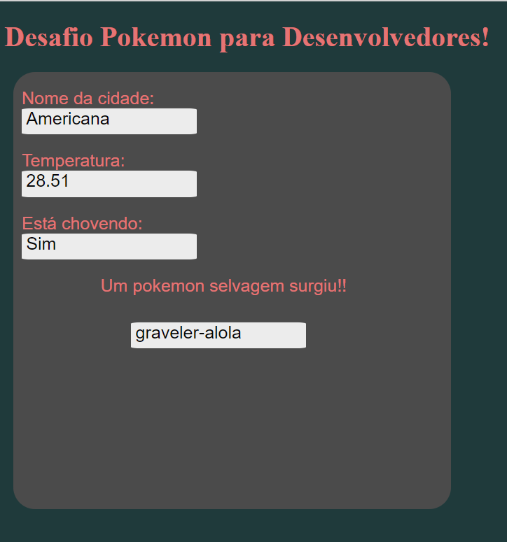

# Desafio Pokémon para Desenvolvedores
## Tecnologias utilizadas:
- Visual Studio Code.
- Linguagens de Desenvolvimento web HTML, CSS, JavaScript. 
## Passo a passo para utilização:
- Primeiramente, salve o projeto em seu computador. O próprio github oferece essa ferramenta de download do projeto em formato ZIP, como na imagem:

    

- Agora que o projeto está salvo, extraia seus dados para alguma pasta, entre na pasta do projeto e abra o arquivo **index** presente na raiz da pasta: 

    

- Com o arquivo aberto no seu navegador, digite o nome de qualquer cidade de sua escolha (Funcionará apenas com nomes de cidades válidos existentes): 

    

- Após digitar o nome da cidade, essa será a tela que você verá, com todos os dados do desafio presentes: 

    

## O Desafio
- Em uma página HTML deve ser possível informar uma cidade de qualquer lugar do mundo;
- De acordo com as condições climáticas desta cidade deve-se exibir um Pokémon baseado em seu tipo (fogo, água, elétrico, etc) seguindo as seguintes regras:

  - Lugares onde a temperatura for menor **(<) que 5ºC**, deve-se retornar um pokémon de gelo **(ice)**.
  - Lugares onde a temperatura estiver entre **(>=) 5ºC e (<) 10ºC**, deve-se retornar um pokémon do tipo **água (water)**.
  - Lugares onde a temperatura estiver entre **(>=) 12ºC e (<) 15ºC**, deve-se retornar um pokémon do tipo **grama (grass)**.
  - Lugares onde a temperatura estiver entre **(>=) 15ºC e (<) 21ºC**, deve-se retornar um pokémon do tipo **terra (ground)**.
  - Lugares onde a temperatura estiver entre **(>=) 23ºC e (<) 27ºC**, deve-se retornar um pokémon do tipo **inseto (bug)**.
  - Lugares onde a temperatura estiver entre **(>=) 27ºC e 33ºC inclusive**, deve-se retornar um pokémon do tipo **pedra (rock)**.
  - Lugares onde a temperatura for **maior que 33ºC**, deve-se retornar um pokémon do tipo **fogo (fire)**.

- **Para qualquer outra temperatura**, deve-se retornar um pokémon do tipo **normal**.
- E, no caso em que **esteja chovendo na região** um pokémon **elétrico (electric)** deve ser retornado, independente da temperatura.

- O pokémon mostrado deve ser aleatório e não deve aparecer duas vezes consecutivas;
- Após a consulta deve-se exibir na tela:

  - Temperatura atual da cidade em graus Celcius;
  - Se está chovendo ou não;
  - Nome do Pokémon seguindo as regras acima.
## Informações Adicionais
* [ ] Utilizar o Docker durante o desafio será considerado como ponto adicional; **(não é um requisito obrigatório)**

* [ ] Testes unitários também serão considerados como ponto adicional; **(não é um requisito obrigatório)**

* [x] Uma breve documentação com os passos para executar a aplicação deve ser elaborada; **(requisito obrigatório)**

* [x] Na documentação deve constar as tecnologias utilizadas; **(requisito obrigatório)**

* [ ] Qualquer coisa adicionada como extra por parte do desenvolvedor, por exemplo exibir a imagem do pokémon na tela, será contabilizada como ponto extra, desde que os outros requisitos estejam 100% funcionais; **(não é um requisito obrigatório)**

* [x] Todo o código deve ser adicionado no em seu Github ou Gitlab pessoal, além da documentação no formato markdown facilmente aceito por essas plataformas. **(requisito obrigatório)**